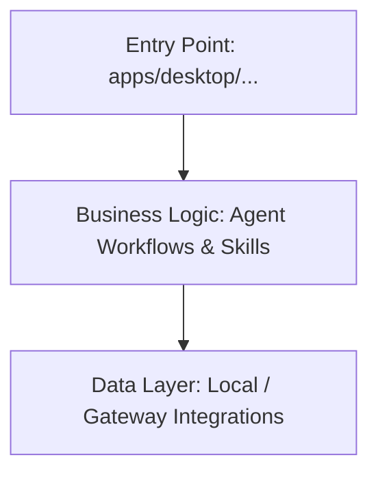

# Architecture

> Auto-generated by /map on 2026-03-03T22:52:52+05:30

## Overview

The `agentic_chatbot` project is an autonomous, agentic coding assistant application designed by Google. It implements a sophisticated agent system capable of interacting with web browsers, analyzing codebases, editing files, and fulfilling developer tasks. At its core, it interacts with various LLMs (like Gemini, Claude, and OpenAI via a gateway). It incorporates the Get Shit Done (GSD) Methodology.

## Components

### Applications (`apps/`)
- **Purpose:** Houses the main execution entry points and client applications. Includes the primary `desktop` app.
- **Location:** `apps/`
- **Dependencies:** Core framework (`packages/`, `extensions/`), React (for UI), Electron (Desktop).

### Core Agent Logic (`utils/`, `skills/`, `agents/`)
- **Purpose:** Dictates the LLM interaction loops, system prompts, conversation history logging, and specialized skills (e.g., Codebase Mapper, GSD Debugger, Planner).
- **Location:** `skills/`, `workflows/`, and `src/agent/` functionality dispersed.
- **Dependencies:** Prompts, system context tools (`context-compressor`, `context-fetch`).

### Extensions / API Layer (`extensions/`, `packages/`)
- **Purpose:** Abstracted modules for tool calls, gateway endpoints, testing capabilities, and external model provider integrations.
- **Location:** `extensions/` and `packages/`

## Data Flow

1. User sends a message via UI (Desktop app) or CLI.
2. The Agent Core receives the prompt, checks the Current State / History (e.g., in `.gsd/` or `.gemini/` folders).
3. The Agent loads necessary skills and tools, executes API calls or local operations, updates persistent memory files, and formats the output/actions.

## Integration Points

| Service | Type | Purpose |
|---------|------|---------|
| Gemini / Claude | API | Performs actual LLM inference over codebase context. |
| Browser Sandbox | Local/Docker | Sandbox for evaluating web pages / e2e tests (`Dockerfile-sandbox`). |
| Local File System| API | Extensively modifies local code by writing / editing `PROJECT_RULES.md`, `.gsd/`, etc. |

## Technical Debt

- [ ] High dependency complexity relying on `pnpm` and numerous workspaces. Some updates might break interwoven dependencies.
- [ ] Potential code smells: TODO marks discovered via `grep_search`.
- [ ] `STATE.md`, `ROADMAP.md` persistence needs strict adherence by the agent, otherwise risk of context loss.

## Conventions

**Naming:** Modern JS/TS camelCase conventions with heavily structured markdown documentation (`*.md`).
**Structure:** Monorepo using `pnpm-workspace.yaml`, cleanly segmenting `apps`, `packages`, `extensions`, and `ui`.
**Testing:** Extensive use of `vitest` for unit, e2e, gateway, and live testing (`vitest.*.config.ts`).
